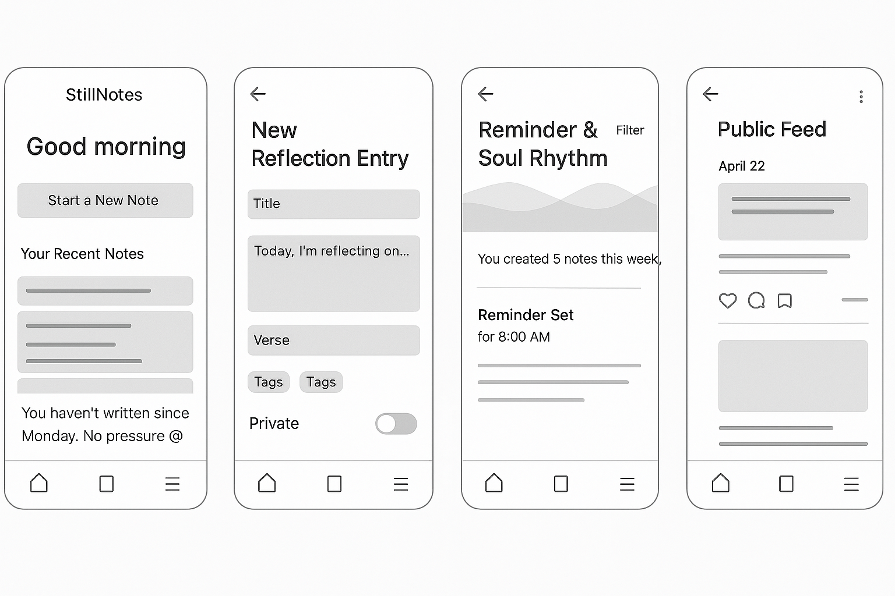
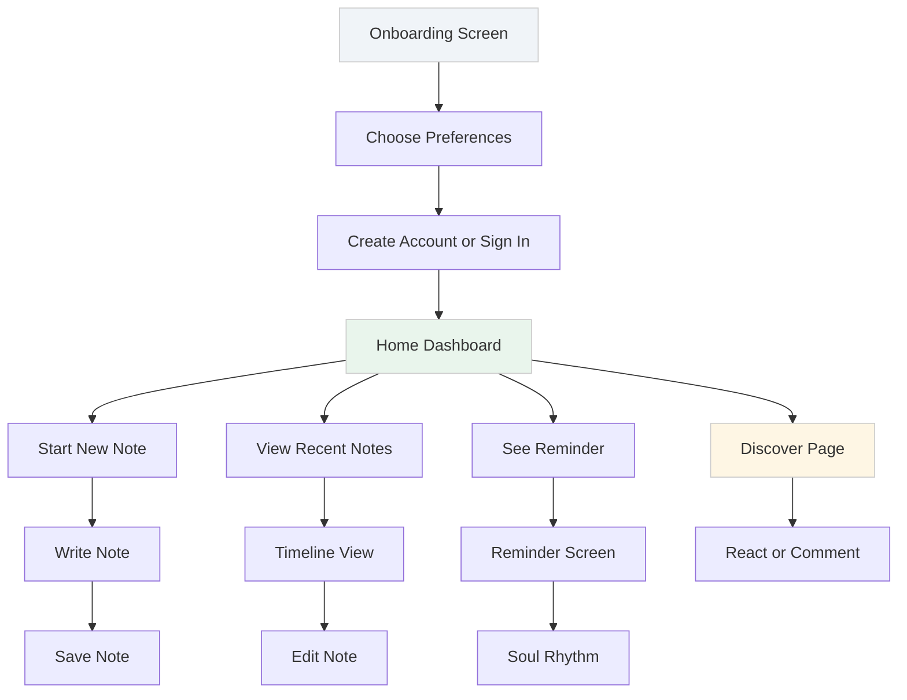
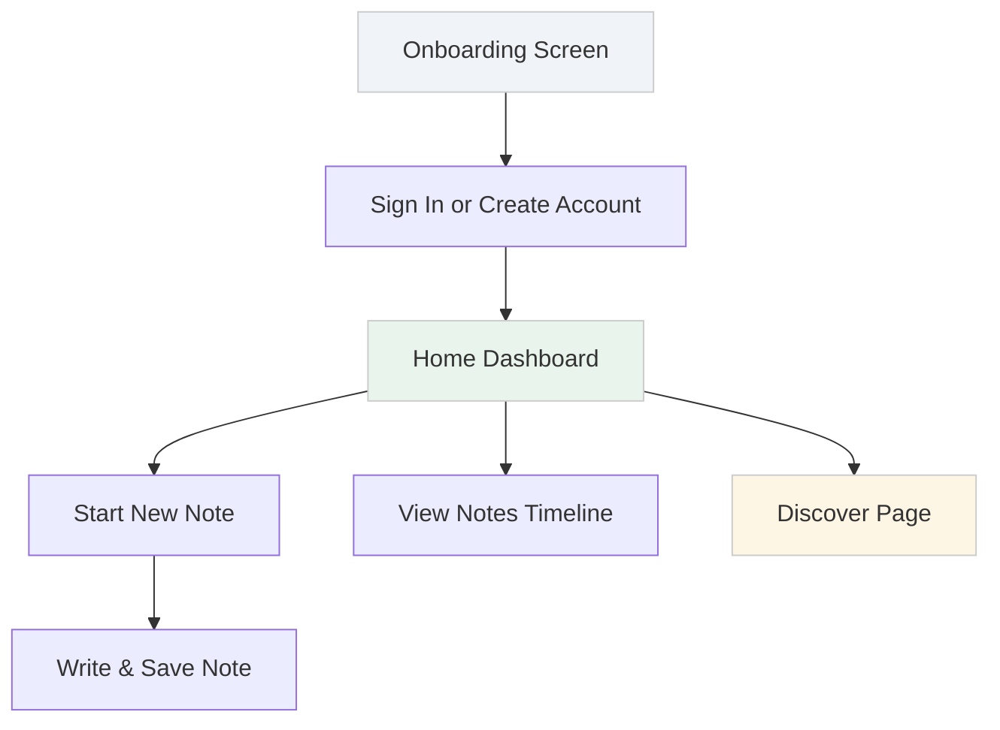
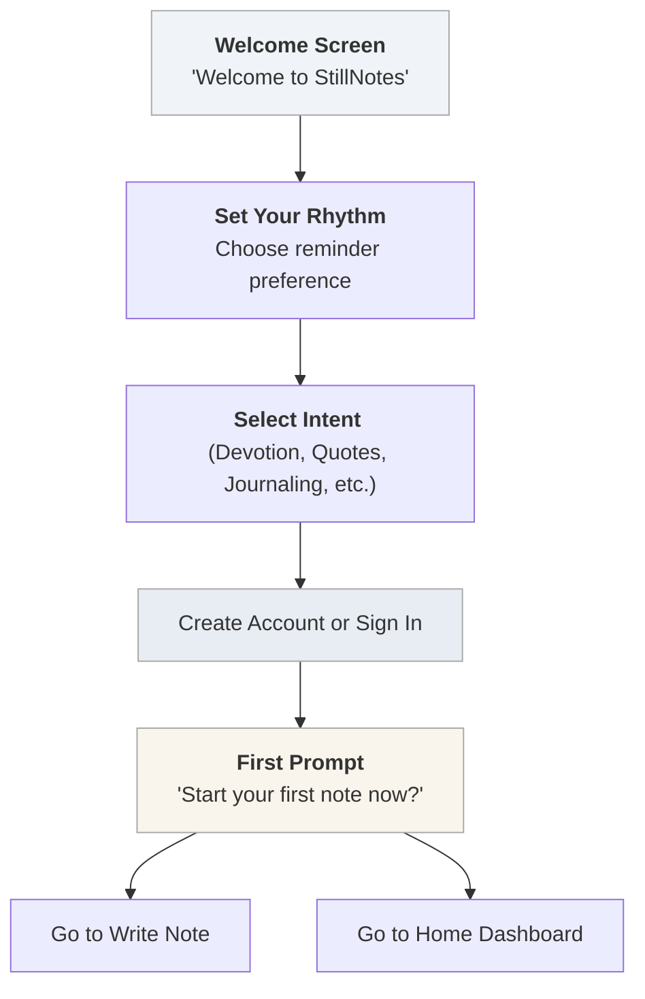

## 🌿 StillNotes – MVP UI Wireframes (Core Screens)

We'll sketch out 5 key screens that reflect your app's quiet and contemplative nature, while still being user-friendly and visually inviting.

### 1. 🏠 **Home / Dashboard**

> “Begin your day in stillness.”

**Elements:**
- Soft greeting (`Good morning, Ama 🙏`)
- “Start a New Note” button (CTA)
- “Your Recent Notes” (scrollable or card layout)
- “Gentle Reminder” (e.g. “You haven’t written since Tuesday. No pressure 😊”)
- Featured verse or quote of the day (optional)
- Bottom nav: 📝 Notes | 🔔 Reminders | 🔍 Discover | 👤 Profile


### 2. 📝 **Create Reflection Entry**

> “Write freely. Or just begin…”

**Layout:**
- Title field (optional)
- Rich text or markdown-enabled entry box (placeholder: *Today, I’m reflecting on…*)
- Optional Scripture/verse field
- Tags (e.g., *peace, trust, waiting*)
- Visibility toggle: `🔒 Private` | `🌤️ Public`
- Save button

> Option: Autosave drafts, emoji reactions toggle (quiet UI)


### 3. 📚 **Notes Library / Timeline**

> “Your journey, gently unfolding.”

**Display:**
- List or grid of previous entries (sorted by date)
- Filter by tag, mood, or scripture
- Quick preview: first few lines or excerpt
- Icons for favorite/starred entries
- Long press or tap to edit

Optional:
- “This day last year” flashback
- Calendar view toggle

### 4. 🔔 **Reminder & Soul Rhythm View**

> “You’ve revisited *‘Trust in the Silence’* 3 times this month.”

**Sections:**
- Timeline-based tracker (e.g., how often you've reflected)
- Gentle analytics (themes or verses repeated)
- Editable reminder preferences (time of day, frequency)
- Encouraging nudge message settings (e.g., “Just breathe and write.”)

This page should **feel light**, not like a metrics dashboard — maybe illustrated with waves, soft dots, or “soul glow” circles instead of charts.

### 5. 💬 **Public Feed / Discovery (optional for MVP)**

> “Notes shared from hearts like yours.”

**If included in MVP:**
- Waterfall or card-style feed of public entries
- Minimalist reactions (🙏 ❤️ 🌿) and short comment threads
- “Featured Reflections” or “Popular Verses”
- Option to follow a writer or save a public note to private library

## 🧭 Wireframe Navigation Map

```
            +---------------------+
            |     Onboarding      |
            +----------+----------+
                       |
            +----------v----------+
            |       Home          |
            +----------+----------+
          /            |           \
+---------v--+   +-----v----+   +---v------+
| New Entry  |   | Timeline |   | Reminders|
+------------+   +----------+   +----------+
         \______________________/     
                   |
            +------v------+
            |   Discover  |
            +-------------+
```
## ⏭️ Low-Fidelity Wireframe Sketches



## 🌊 User Flow Full App




## ✅ Minimal MVP Flowchart (Core Path Only)

Here's a **simplified Mermaid flowchart** of the **core MVP path** — just the essential screens and interactions:



This captures the leanest version of the app — onboarding, writing, revisiting, and light discovery.


## ✨ Envisioning the Onboarding Process

The onboarding should reflect the **StillNotes tone** — *calm, contemplative, welcoming*. Instead of rushing the user in, we gently draw them into a soul-reflective experience. Here's how I envision it:

### 🌿 Step-by-Step Experience

1. **Welcome Screen**
   *Message:*
   *“Welcome to StillNotes — “*Still your mind🧠. Note your heart💖*” .”*

   * “Get Started” button

2. **Set Your Rhythm**
   *Question:*
   *“Would you like gentle reminders to write or reflect?”*

   * Choices: Yes, Occasionally, No thanks
   * Optionally choose preferred time of day

3. **Your Intent** *(Optional)*
   *Prompt:*
   *“Why are you here?”*

   * Select one or more:

     * Daily devotion
     * Tracking quotes & inspiration
     * Processing thoughts
     * Journaling through seasons
     * Just exploring

4. **Create Account or Continue Anonymously**

   * Email & password OR
   * Sign in with Google/Apple
   * Option: “Try without account” (with limited access)

5. **First Prompt (Optional)**
   *“Want to begin your first note now?”*

   * Yes → opens new note
   * Not now → goes to Home

### 🎨 Vibe

* Background: soft tones (warm off-white or twilight blue)
* Fonts: serif or soft rounded sans
* Animation: subtle fade-ins, not bouncy
* Messaging: poetic, non-intrusive, meditative

Great! Here's the **Mermaid flowchart version** of the envisioned **StillNotes onboarding process**, designed to reflect the calm and reflective experience you're aiming for:


### 🌿 **StillNotes – Onboarding Flowchart (Mermaid)**


